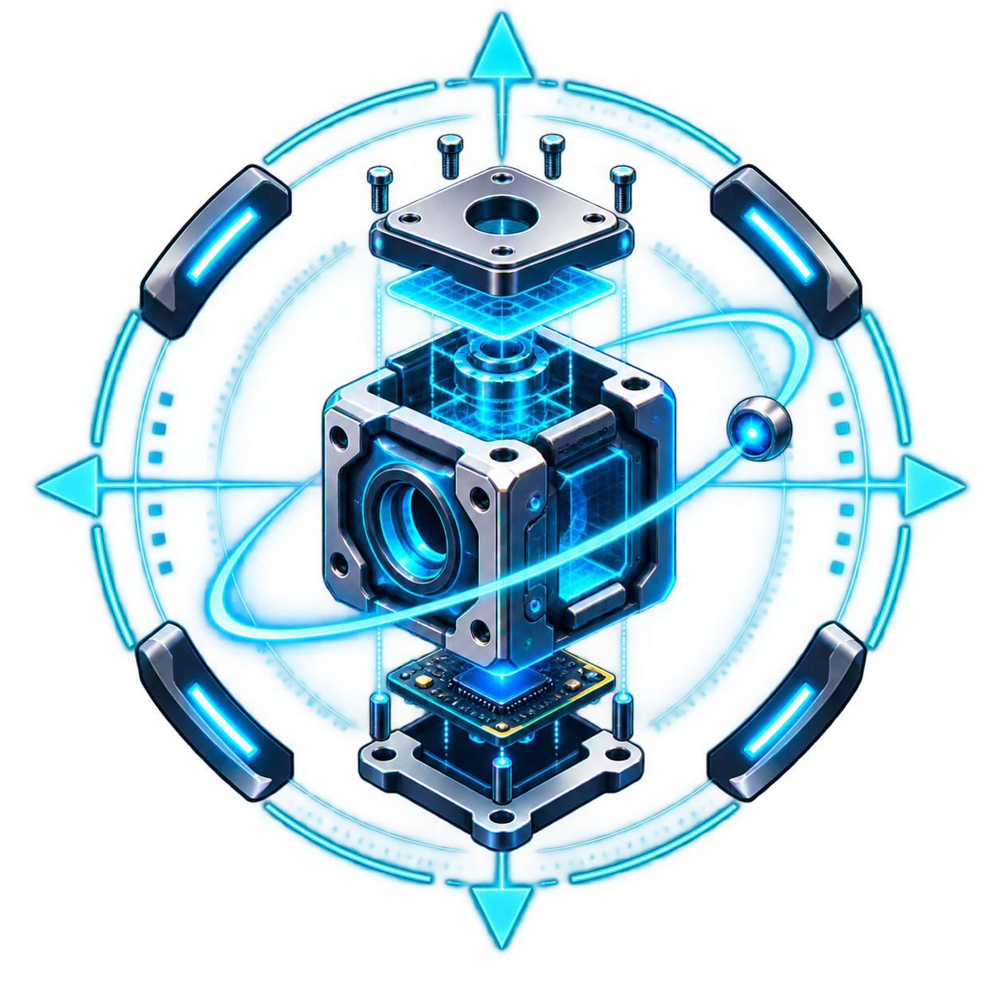
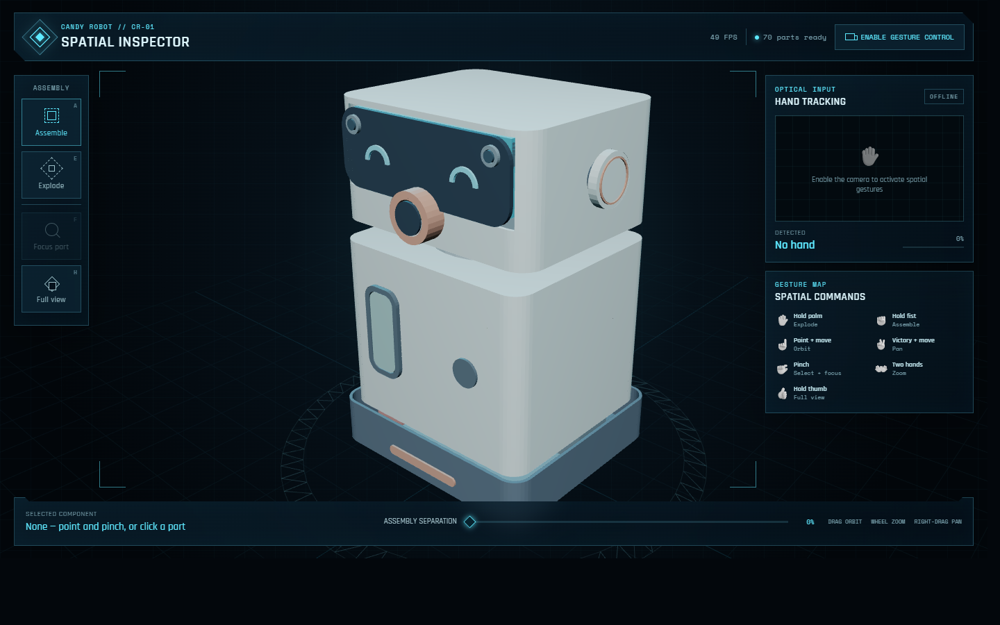

<p align="center">
  
</p>

<h1 align="center">Spatial Hardware Inspector</h1>

<p align="center">
  A local-first, gesture-controlled 3D engineering viewer for robots and physical products.
</p>

<p align="center">
  <a href="https://github.com/SouravBeraAkaSpeed/spatial_hardware_inspector/actions"></a>
  <a href="LICENSE"></a>
  
  
  
</p>



Spatial Hardware Inspector turns a GLB assembly into an interactive engineering workspace. Load a product at runtime, explode or reassemble it, inspect individual parts, display millimetre dimensions, and navigate with a mouse or two-hand spatial gestures. The viewer is universal: no Candy Robot geometry is compiled into the application.

> [!IMPORTANT]
> The viewer visualizes engineering evidence; it does not certify that a model is safe or manufacturable. A linked manifest can report design status and nominal dimensions, but manufacturing release remains the responsibility of the product workflow and its validation evidence.

## Highlights

- Loads local `.glb` files and matching engineering manifests without uploading them.
- Loads CORS-enabled hosted `.glb`/`.gltf` models when a URL is explicitly supplied.
- Explodes and reassembles named parts with adaptive inspection lighting.
- Selects, focuses, and dimension-labels individual components.
- Supports orbit, pan, zoom, selection, full view, and two-hand focus gestures.
- Lists connected cameras and exposes supported resolution, frame-rate, and hardware controls.
- Runs MediaPipe inference in a Web Worker and discards stale frames to keep interaction responsive.
- Benchmarks CPU and GPU delegates on live camera frames and keeps the faster useful option.
- Stores recent product URLs and camera preferences only in local browser storage.
- Bundles the gesture model and WebAssembly runtime for local operation.

## Quick start

### Option A — Download the release

1. Download `Spatial-Hardware-Inspector-v1.0.0.zip` from [Releases](https://github.com/SouravBeraAkaSpeed/spatial_hardware_inspector/releases).
2. Extract the ZIP to a normal folder.
3. Double-click `Start-SpatialHardwareInspector.cmd`.
4. Use **Load product** to choose a GLB and, when available, its engineering JSON manifest.

The launcher installs locked npm dependencies the first time it runs. Use Node.js `20.19+` or `22.12+`.

### Option B — Run from source

```powershell
git clone https://github.com/SouravBeraAkaSpeed/spatial_hardware_inspector.git
cd spatial_hardware_inspector
npm ci
npm start
```

The app opens at <http://127.0.0.1:5173/> by default.

## Load a product

Press **Load product** or `L`.

- **Local project:** select a self-contained `.glb` and an optional engineering `.json` manifest. Drag-and-drop works too.
- **Hosted project:** enter a CORS-enabled GLB/GLTF URL and an optional manifest URL.
- **Plain model:** choose the source units and up axis. The viewer measures mesh bounds and marks the result as a preview.
- **Engineering model:** the manifest supplies product identity, exact millimetre dimensions, materials, processes, clearances, and geometry status.

A hosted product can be opened directly:

```text
http://127.0.0.1:5173/?model=https://example.com/device.glb&manifest=https://example.com/device_manifest.json
```

Optional query parameters are `units=mm|cm|m|in`, `up=X|Y|Z`, and `view=exploded`.

## Controls

| Input | Action |
|---|---|
| Hold open palm | Explode all parts from the assembly center |
| Hold closed fist | Reassemble the product |
| Point upward and move | Orbit the camera |
| Victory sign and move | Pan the scene |
| “I love you” sign (🤟) and move | Aim without moving the camera |
| Touch thumb and index fingertips on both hands | Aim using the two-grip midpoint |
| Spread both grips | Lock the target, select it, and zoom in |
| Bring both grips together | Return toward the pre-focus view |
| Hold thumbs-up | Restore the full product view |
| Left drag / wheel / right drag | Orbit / zoom / pan with a mouse |
| Click a part | Select it |
| `E`, `A`, `F`, `D`, `H`, `C`, `L` | Explode, assemble, focus, dimensions, home, camera, load |

See [docs/GESTURES.md](docs/GESTURES.md) for recognition behavior and practical camera guidance.

## Engineering manifest

The GLB should contain one named mesh for every printed part, fabricated part, purchased component, or reference object. Manifest keys must match mesh names exactly.

```json
{
  "schemaVersion": "1.0.0",
  "project": {
    "name": "Example Device",
    "code": "ED-01",
    "revision": "R1",
    "viewerTitle": "Spatial Engineering Inspector"
  },
  "model": {
    "units": "mm",
    "upAxis": "Z",
    "dimensionsMm": [220, 180, 310],
    "partCount": 1
  },
  "parts": {
    "exterior__top_shell": {
      "id": "exterior__top_shell",
      "label": "Top Shell",
      "group": "exterior",
      "units": "mm",
      "dimensionsMm": [220, 180, 80],
      "engineering": {
        "part_type": "printed",
        "geometry_status": "design_exact",
        "manufacturing_process": "FDM",
        "material": "PETG",
        "nominal_clearance_mm": 0.35
      }
    }
  }
}
```

The canonical [JSON Schema](docs/engineering-manifest.schema.json) and complete [model contract](docs/MODEL_CONTRACT.md) are versioned with the viewer. A manifest is shown as compatible only when every mesh has a record and every record has a mesh.

## Camera and latency design

Camera frames follow `requestVideoFrameCallback()` when the browser supports it. One transferable 384×216 analysis frame may be in flight at a time; a newer frame replaces stale work instead of joining a queue. Recognition runs outside the Three.js main thread. The top bar reports completed AI round-trip latency and result rate rather than merely reporting the camera's advertised FPS.

Camera capability labels describe modes the browser and driver expose. “Best speed” and “best latency” are recommendations for gesture tracking, not claims that one physical camera is universally better than another.

## Development and verification

```powershell
npm ci
npm test
npm run build
```

`npm test` checks the repository contract and bundled runtime assets. `npm run build` produces the production bundle under `dist/`. The hardware smoke test drives a real Chromium debug session and is documented in [docs/TESTING.md](docs/TESTING.md).

## Project structure

```text
spatial_hardware_inspector/
├── index.html                         # application shell and controls
├── src/
│   ├── app.js                         # Three.js viewer, loader, camera, gestures
│   ├── gesture-worker.js              # off-main-thread MediaPipe inference
│   ├── mediapipe-assets/              # worker-resolved local runtime loader
│   └── styles.css                     # responsive spatial interface
├── public/
│   ├── gesture_recognizer.task        # local MediaPipe gesture model
│   └── wasm/                          # local MediaPipe WebAssembly runtime
├── scripts/                            # package and hardware smoke tests
├── docs/                               # contracts, architecture, privacy, guides
└── START_VIEWER.cmd                    # stable launcher used by hardware workflows
```

## Documentation

- [Architecture](docs/ARCHITECTURE.md)
- [Model and manifest contract](docs/MODEL_CONTRACT.md)
- [Gesture guide](docs/GESTURES.md)
- [Privacy model](docs/PRIVACY.md)
- [Testing guide](docs/TESTING.md)
- [Third-party notices](THIRD_PARTY_NOTICES.md)

## Contributing

Issues and pull requests are welcome. Read [CONTRIBUTING.md](CONTRIBUTING.md) before proposing changes. Report security-sensitive behavior privately as described in [SECURITY.md](SECURITY.md).

## Author

Created by **[Sourav Bera](https://github.com/SouravBeraAkaSpeed)** — Founder of TOil Labs and Head of Tech at QuarqLabs — as part of a reusable idea-to-manufacturing hardware workflow.

## License

Released under the [MIT License](LICENSE). MediaPipe, Three.js, Vite, the bundled model, and their runtime assets remain subject to their respective upstream licenses; see [THIRD_PARTY_NOTICES.md](THIRD_PARTY_NOTICES.md).
